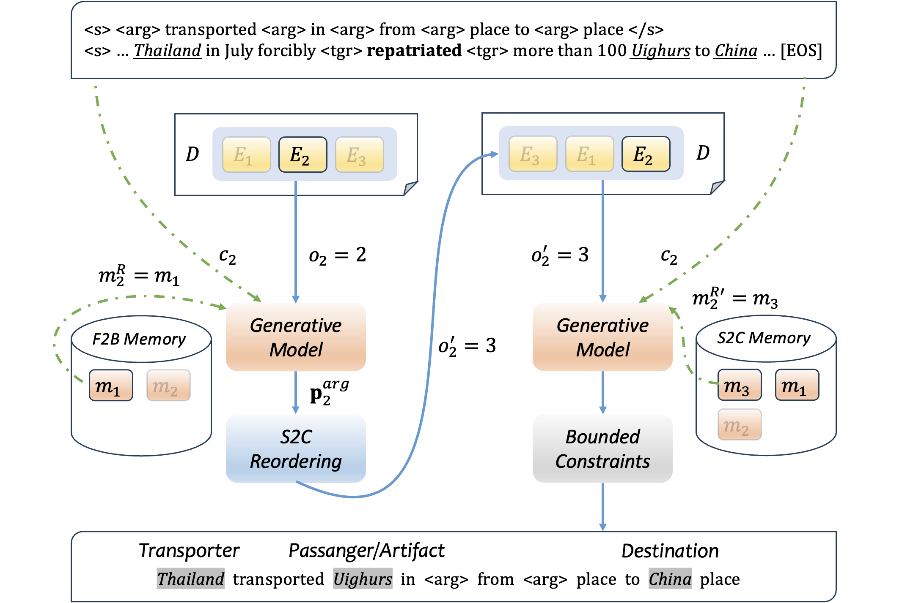

# From Simple to Complex: A Progressive Framework for Document-level Informative Argument Extraction

Code for our EMNLP 2023 paper.

## Model Overview
The figure below illustrates our simple-to-complex progressive framework for document-level IAE. First, it calculates the prediction difficulty for each event in document $D$ at the first inference (blue route). Second, it orders these events from simple to complex and predict them accordingly (green route). Here, we plot the prediction process of $E_1$.




## Dependencies 
- pytorch=1.8.0
- transformers=3.1.0
- pytorch-lightning=1.0.6
- spacy=3.0
- sentence-transformers=2.1.0


## Datasets
- WikiEvents (download from [this repo](https://github.com/xinyadu/memory_docie))


## Running

- Confidence calibration
	
	```
	bash scripts/calibrate.sh
	```

- Training

	```
	bash scripts/train_kairos.sh
	```

- Testing

	```
	bash scripts/test_kairos.sh
	```